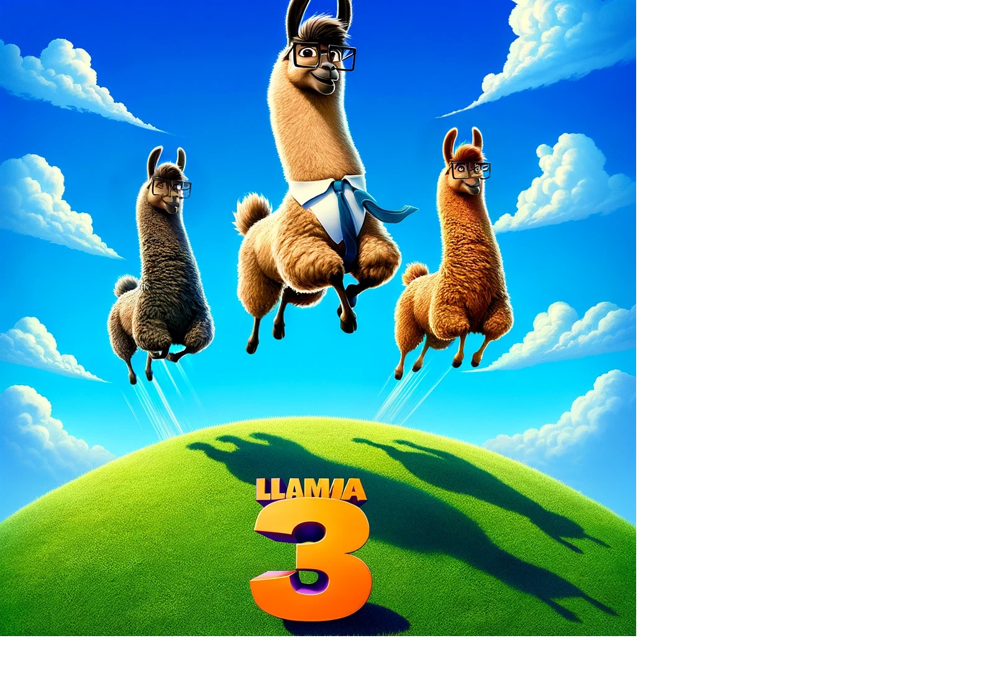

# LLaMA3_Cookbook 🦙✨
안경을 쓴 귀여운 라마들 > _ <

LLaMA3 (Large Language Model by META AI)는 AI 기술의 최전선에서 활약하는 대규모 언어 모델입니다. 🌟 이 저장소📁는 LLaMA3를 활용하여 다양한 프로젝트🚀를 시작하는 데 필요한 정보를 제공하고자 합니다.

## [📜Introducing Meta Llama 3: The most capable openly available LLM to date 리뷰 ](https://hyun941213.tistory.com/entry/Introducing-Meta-Llama-3-The-most-capable-openly-available-LLM-to-date-%EB%A6%AC%EB%B7%B0)

## 공식 웹사이트 및 정보 🌐
- [공식 홈페이지 🏠](https://llama.meta.com/)
- [접근 요청 📬](https://llama.meta.com/llama-downloads/)
- [Meta Llama Model 카드 🎴](https://llama.meta.com/docs/model-cards-and-prompt-formats/meta-llama-3)
- [Kaggle Meta 🏅](https://www.kaggle.com/organizations/metaresearch/models)

## ⚡️ Cloud API 
### API 호출 가능 🔌
| 이름          | 설명                                                              | 링크 |
|--------------|-------------------------------------------------------------------|-----|
| Grok         | 고성능 AI Chip을 통해 LLaMA3 인퍼런스 및 API 호출 가능            | [Grok 🌐](https://console.groq.com/playground) |
| AWS          | Bedrock에서 LLaMA 지원, 현재는 Llama2만 사용 가능                  | [AWS 🌐](https://aws.amazon.com/ko/bedrock/) |
| Azure        | Microsoft Azure에서 8B/70B 모델 지원, Azure Marketplace에서 검색 가능 | [Azure 🌐](https://azuremarketplace.microsoft.com/en-us/marketplace/apps/metagenai.meta-llama-3-8b-chat-offer?tab=overview)|
| GCP| Google Cloud Vertax AI 에서 사용 가능 | [GCP 🌐](https://console.cloud.google.com/vertex-ai/publishers/meta/model-garden/llama3?_ga=2.164398141.-384541959.1712575317)
| together.ai  | Llama2, CodeLlama, Llama3 8b/70b 인스턴스 사용 가능                | [together.ai 🌐](https://www.together.ai/) |
| replicate    | Llama3 API 지원 (Node.js, Python, HTTP)                            | [replicate 🌐](https://replicate.com/blog/run-llama-3-with-an-api) |
| llama AI    | Llama3 8B/70B 지원, 다른 OpenLLM 지원                         | [llama AI 🌐](https://www.llama-api.com/) |
| Meta AI(github) | meta AI api 연결 | [MetaAI 🌐](https://github.com/Strvm/meta-ai-api?tab=readme-ov-file)|

## 🤖 인퍼런스 (Inference) 🧠

### 인퍼런스 플랫폼 🖥️
| 플랫폼 이름   | 설명                               | 링크 |
|--------------|------------------------------------|-----|
| HuggingFace  | Llama 8B 모델                      | [Link 🌐](https://meta-llama/Meta-Llama-3-8B) |
| HuggingFace  | Llama 70B 모델                     | [Link 🌐](https://huggingface.co/meta-llama/Meta-Llama-3-70B) |
| HuggingFace  | Llama 8B Instruct 모델             | [Link 🌐](https://huggingface.co/meta-llama/Meta-Llama-3-8B-Instruct) |
| HuggingFace  | Llama 70B Instruct 모델            | [Link 🌐](https://huggingface.co/meta-llama/Meta-Llama-3-70B-Instruct) |
| HuggingFace  | Llama Guard-2-8B(정책모델)         | [Link 🌐](https://huggingface.co/meta-llama/Meta-Llama-Guard-2-8B) |
| HuggingFace | Llama 8B KO (made beomi) | [Link 🌐](https://huggingface.co/beomi/Llama-3-Open-Ko-8B-preview)|
| Ollama       | 다양한 경량화된 Llama3 모델 인퍼런스 가능 | [Link 🌐](https://ollama.com/library/llama3) |

### HuggingFace 모델 🐥
| 이름   | 설명                               | 링크 |
|--------------|----------------------------|-----|
|cognitivecomputations/dolphin-2.9-llama3-8b| 무검열 파인튜닝 | [Link 🌐](https://huggingface.co/cognitivecomputations/dolphin-2.9-llama3-8b)|
|McGill-NLP/Llama-3-8B-Web| 제로샷 인터넷 링크 선택 능력 |[Link 🌐](https://huggingface.co/McGill-NLP/Llama-3-8B-Web)
## 💬 Chat Interface (Related Information) 💻
| 이름              | 링크 |
|-----------------|-----|
| HuggingChat     | [Link 🌐](https://huggingface.co/chat/) |
| Groq            | [Link 🌐](https://groq.com/) |
| together.ai     | [Link 🌐](https://www.together.ai/) |
| replicate Llama chat(local) | [Link 🌐](https://github.com/replicate/llama-chat)|
| perplexity.ai(경량화모델) | [Link 🌐](https://labs.perplexity.ai/)|
|openrouter.ai| [Link 🌐](https://openrouter.ai/playground?models=meta-llama/llama-3-70b-instruct)|
| MetaAI (한국 사용불가)|[Link 🌐](https://www.meta.ai/)|
| Morphic(멀티모달제공) | [Link 🌐](https://www.morphic.sh/)|

## LLaMA Framework  📘
| 이름       |유형| 링크 
|----------|-----|-----|
| Langchain | RAG | [Link 🌐](https://www.langchain.com/) |
| llamaindex| RAG | [Link 🌐](https://www.llamaindex.ai/) |
| llama.cpp| convert | [Link 🌐](https://github.com/ggerganov/llama.cpp) |

## 🛠️ 파인튜닝 (Fine-tuning) 🔧
| 이름      | 링크 |
|---------|-----|
| Meta | [Link 🌐](https://llama.meta.com/docs/how-to-guides/fine-tuning/)
| torchrune| [Link 🌐](https://github.com/pytorch/torchtune)|
| LLaMAFactory| [Link 🌐](https://github.com/hiyouga/LLaMA-Factory)|
|axolotl| [Link 🌐](https://github.com/OpenAccess-AI-Collective/axolotl)|

## LLAMA3_Cookbook 👩‍🍳
| 정보                               | 링크 |
|----------------------------------|-----|
| 프롬프트 엔지니어링 가이드           | [Link 🌐](https://www.promptingguide.ai/tools)|
| WEB UI 를 사용해서 llama3 사용 | [Link 🌐](https://dev.to/timesurgelabs/how-to-run-llama-3-locally-with-ollama-and-open-webui-297d) |
| API with Ollama, LangChain and ChromaDB with Flask API and PDF upload | [Link 🌐](https://www.youtube.com/watch?v=7VAs22LC7WE) |
| 맥북관련 Llama 튜닝 및 인퍼런스 가이드 | [Link 🌐](https://itnext.io/step-by-step-guide-to-running-latest-llm-model-meta-llama-3-on-apple-silicon-macs-m1-m2-or-m3-b9424ada6840) | 
| Fine-tune Llama 3 with ORPO | [Link 🌐](https://huggingface.co/blog/mlabonne/orpo-llama-3)|
| Qlora_aplaca_llama3 finetune | [Link 🌐](https://colab.research.google.com/drive/1mPw6P52cERr93w3CMBiJjocdTnyPiKTX#scrollTo=6bZsfBuZDeCL)
| fully local RAG agents with LLama3 | [Link 🌐](https://github.com/langchain-ai/langgraph/blob/main/examples/rag/langgraph_rag_agent_llama3_local.ipynb) |
| RAG Chatbot LLama3(HF) | [Link 🌐](https://huggingface.co/blog/not-lain/rag-chatbot-using-llama3) |
| llama index RAG llama3 | [Link 🌐](https://lightning.ai/lightning-ai/studios/rag-using-llama-3-by-meta-ai) |
| ollama RAG + UI(Gradio) | [Link 🌐](https://mer.vin/2024/04/llama-3-rag-using-ollama/) |

## LLM Dataset 🗂️
| 정보                               | 링크 |
|----------------------------------|-----|

## LLM skills 📌
| 정보                               | 링크 |
|----------------------------------|-----|
|FSDP+QLORA finetunning | [Link 🌐](https://github.com/AnswerDotAI/fsdp_qlora)|

## MAC vs 4090 비교 🖥️🆚🖥️
| 항목          | M3 Max                              | M1 Pro                    | RTX 4090                                    |
|---------------|-------------------------------------|---------------------------|---------------------------------------------|
| CPU 코어      | 16코어                              | 10코어                    | 16코어 AMD                                  |
| 메모리        | 128GB                               | 16GB    /32GB                  | 32GB                                        |
| GPU 메모리    | 16코어 CPU 및 40코어 GPU, 400GB/s 메모리 대역폭                           | 10코어 CPU(성능 코어 8개 및 효율 코어 2개) 16코어 GPU 200GB/s 메모리 대역폭                   | 24GB                                        |
| **모델 7B**   | - 모든 컴퓨터에서 잘 작동           | - 모든 컴퓨터에서 잘 작동 | - 모든 컴퓨터에서 잘 작동,성능 M3 Max와 유사                  |
| **모델 13B**  | - 성능 좋음                         | - 세 번째로 성능 좋음     | - 가장 성능 좋음                            |
| **모델 70B**  | - 빠르게 실행, 128GB 메모리 활용    | - 16GB 부족, 크래시 및 재부팅 | - GPU에서 실행 불가, CPU에서 매우 느리게 실행 |
| 경량화 여부   | 메모리가 충분하다면 하지 않아도 됨 | 해야할 듯 함 | Quantization 타협을 해야함 |
| 전력 소모      | 65W                                |                           | 250-300W                                    |
| 가격 대비 성능 | 우수 ($4600)                       |                           | 비교적 낮음 ($6000 for A6000 GPU)           |

## 🙌 기여하기 💖
이 저장소에 기여하고 싶으신가요? [Issues](https://github.com/your-github/LLaMA3_Recipes/issues)에 자유롭게 의견을 남기거나 Pull Request를 보내주세요. 모든 종류의 기여를 환영합니다!

## 📩 문의하기 💌
더 많은 정보가 필요하거나 협력을 희망하시는 분은 [여기](https://github.com/your-github/LLaMA3_Recipes)를 클릭하여 저에게 메시지를 보내주세요. 함께 지식을 나누고 싶습니다!
